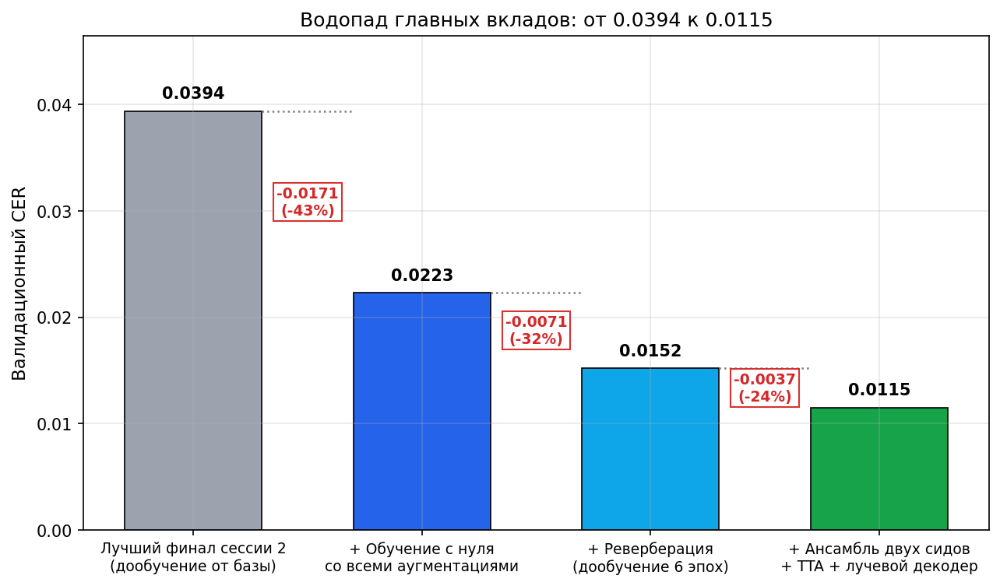
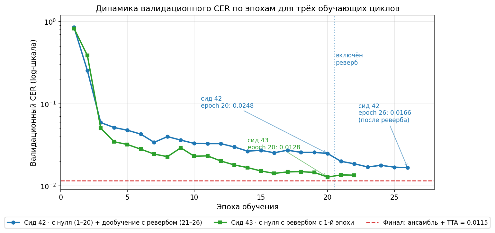
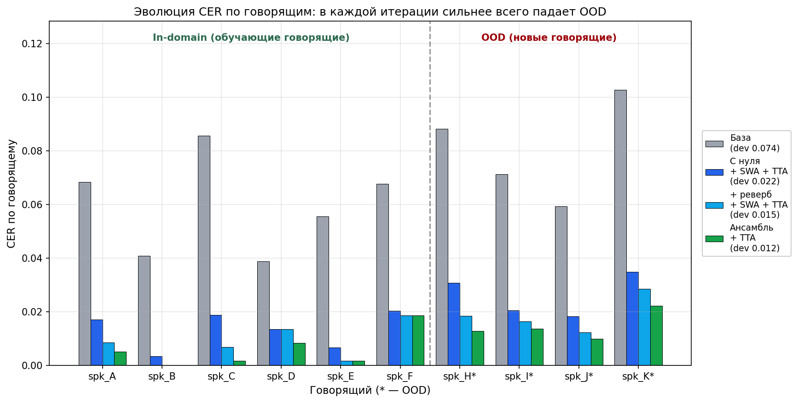

# Распознавание произнесённых чисел на русском — отчёт по стратегии

Соревнование: [asr-2026-spoken-numbers-recognition-challenge](https://www.kaggle.com/competitions/asr-2026-spoken-numbers-recognition-challenge).

Финальный результат на публичной части лидерборда: **0.946 CER**, место **#3**.
Выполнили: вредный **Георгий Мамарин** и обаятельная **Оксана Соломенчук**

## Задача и метрика

На вход — аудиозапись, где человек называет число (русской речью). На выход — то же число в виде строки цифр. Диапазон значений в данных — от нескольких единиц до 999 999.

Основная метрика соревнования — **Character Error Rate** (CER), посимвольное редакционное расстояние между предсказанной строкой цифр и эталонной, нормированное на длину эталона. Ошибки считаются по цифровому представлению числа, а не по словесному.

При локальной валидации дополнительно использовалось **гармоническое среднее CER по доменам** (in-domain — говорящие, которые есть в обучении; OOD — новые):

```
harmonic_cer = 2 · CER_in · CER_ood / (CER_in + CER_ood)
```

Гармоническое среднее сильно штрафует модели с дисбалансом между доменами: если один из CER растёт, `harmonic_cer` реагирует сильнее, чем обычное среднее. Поскольку Kaggle-метрика соревнования делает акцент на OOD-говорящих, именно `harmonic_cer` на валидации использовался как критерий выбора чекпоинтов.

Далее в отчёте «CER» без уточнения — это валидационный CER по всей выборке.

## Ограничения задачи

- Обучение только на предоставленных данных, с нуля.
- Модель не более 5 млн параметров (у нас ~3.5 млн).
- Инференс — самодостаточный, 16 кГц, без `torchaudio`.

## Коротко

| # | Этап | Ключевая идея | Валидационный CER | LB |
|:-:|:--|:--|:--:|:--:|
| 0 | Базовая модель (прошлая сессия) | Conv + BiGRU + CTC, слабые аугментации | 0.0738 | 6.835 |
| 1 | Набор аугментаций v2, +1 эпоха | mp3 / полоса / тон + балансировка говорящих + усиленный SpecAugment | 0.0535 | 5.082 |
| 2 | Дообучение до плато (эпоха 6) | тот же рецепт, убывающий LR | 0.0455 | 4.440 |
| 3 | SWA двух соседних эпох (8, 9) | первое полезное усреднение весов | 0.0394 | 4.034 |
| 4 | **Обучение с нуля 20 эпох + SWA + TTA** | чистый старт со всеми аугментациями | 0.0223 | **2.362** |
| 5 | **+ реверберация, дообучение 6 эпох + SWA + TTA** | последний акустический разрыв (эхо помещений) | 0.0152 | **1.507** |
| 6 | **Ансамбль двух моделей (сиды 42 и 43) + TTA + грамматический лучевой декодер** | разнообразие инициализаций + усреднение логитов | **0.0115** | **0.946** |

Снижение CER от базы этой сессии: **−86 %**.

Траектория LB:

```
Шаг:      0        1        2        3        4        5        6
CER:    6.835    5.082    4.440    4.034    2.362    1.507    0.946
                   │        │        │        │        │        │
                аугмент.   +2э.     SWA     с нуля    реверб   ансамбль
```

## Анализ данных — отправная точка стратегии

Сравнение обучающей и валидационной выборок сразу подсказало направление работы.

| Свойство | Обучение (12 553 записи) | Валидация (2 265 записей) |
|:--|:--:|:--:|
| Расширение файла | только `wav` | `wav` 1 577 + **`mp3` 688** |
| Частота дискретизации | 24 000 / 22 050 Гц | **16 000 Гц** (родная) |
| Число говорящих | 6: E 45 %, B 23 %, A/C/D/F ≤ 10 % | 10 (4 полностью новых: H, I, J, K) |
| Длина аудио | ~0.5–3 с | ~0.5–3 с |
| Распределение меток | равномерно в `[14; 999 888]` | равномерно в `[1 363; 999 669]` |

**Главный вывод.** Тестовая выборка, судя по валидации, содержит три расхождения с обучением: mp3-компрессию, родной 16 кГц звук и «новых» говорящих. Исходная гипотеза — основной выигрыш в закрытии этих расхождений через аугментации, а не через архитектуру. Впоследствии к списку добавилось четвёртое — эхо помещений; это не было видно из csv-метаданных и стало видно только после анализа остаточных ошибок на валидации.

## Архитектура модели

Блок-диаграмма финальной модели (идентична для сидов 42 и 43):

```
waveform  (B, T_samples)         — 16 кГц моно
    │
    ▼
Log-mel спектрограмма            — n_fft=400, hop=160, 80 mel-бинов
    │   (B, T_frames, 80)           (без torchaudio, на scipy STFT)
    ▼
Покадровая нормализация          — маскированные mean/std по длине
    │
    ▼
SpecAugment (только обучение)    — временные + частотные маски
    │
    ▼
Conv1d(80 → 192, k=5, s=2)       — GELU, Dropout 0.2
    │
Conv1d(192 → 256, k=5, s=2)      — GELU, Dropout 0.2
    │   (B, T_frames/4, 256)
    ▼
BiGRU × 3 слоя                   — hidden=256, dropout 0.2
    │   (B, T_frames/4, 512)
    ▼
Linear(512 → 43)                 — CTC-логиты (42 слова + blank)
```

Итого ~3.5 млн параметров.

Ключевые архитектурные решения:

- **CTC на уровне слов, а не букв.** Словарь из 42 слов + blank: «ноль», 9 мужских единиц «один…девять», 2 женских формы «одна, две» (остальные единицы совпадают с мужскими), 10 от «десяти» до «девятнадцати», 8 десятков, 9 сотен, 3 формы «тысяча/тысячи/тысяч». Любая валидная грамматическая последовательность слов детерминированно разбирается обратно в число.
- **2 свёрточных слоя со страйдом 2 + 3 BiGRU.** Уменьшают временную размерность в 4 раза, что удобно для CTC и держит модель в бюджете 5 млн параметров.
- **Log-mel 80 бинов, n_fft 400, hop 160 при 16 кГц.** Самодостаточный фронтенд на `soundfile` + `scipy`. `torchaudio` в окружении был сломан, и пришлось обойтись без него — заодно сделало кернел инференса проще.
- **AdamW, обрезание градиента нормой 5.0, косинусный график с прогревом.** 

## Что сработало — таблица вкладов

Абляция каждого компонента на финальной конфигурации. «Вклад» — относительное снижение CER на валидации от отключения только этого компонента.

| Компонент | CER без компонента | CER с компонентом | Относительное снижение |
|:--|:--:|:--:|:--:|
| Обучение с нуля с полным набором аугментаций | 0.0394 (лучший финал сессии 2) | 0.0223 | **−43 %** |
| Реверберация в аугментациях | 0.0223 | 0.0152 | **−32 %** |
| Ансамбль двух моделей (сиды 42 и 43) | 0.0152 (сид 42 один, с TTA) | 0.0115 (ансамбль с TTA) | **−24 %** |
| TTA на инференсе | 0.0166 (SWA реверба, жадный) | 0.0152 (SWA реверба + TTA) | **−8 %** |
| Усреднение весов соседних эпох (SWA) | 0.0167 (одиночный лучший чекпоинт) | 0.0166 (SWA, жадный) | **−1 %** |
| Грамматический лучевой декодер | 0.0337 (жадный декодер, сессия 4) | 0.0330 (лучевой, тот же чекпоинт) | **−2 %** |

Главные «кирпичи» — обучение с нуля, реверберация и ансамбль. TTA, SWA и лучевой декодер дают суммарно несколько процентов: поодиночке небольшой вклад, но все три совместимы и работают независимо.

Каскадное представление тех же цифр:



## Что сработало — детализация по порядку вклада

### 1. Полное обучение с нуля со всеми аугментациями (4.034 → 2.362)

Главный перелом. Предыдущие итерации дообучали модель, которая в ранние эпохи никогда не видела mp3, изменение тона или фильтрацию полосы. Веса энкодера были смещены и через дообучение плохо перестраивались. Обучение с нуля с **полным набором аугментаций с первой эпохи** изменило базовые представления энкодера.

Параметры обучения:

- 20 эпох, батч 16, оптимизатор AdamW, пиковый LR = 1e-3.
- Косинусный график LR с прогревом 1.5 эпохи, минимум = 5 % от пика.
- Обрезание градиента нормой 5.0.
- Балансированный сэмплер говорящих (см. пункт 5).

Набор аугментаций (применяются независимо в каждом примере):

- **Преобразование через mp3** (`lameenc`, 48/64/96/128 kbps, вероятность 0.35) — прямая симуляция кодека, встречающегося в валидации.
- **Низкочастотный фильтр** 3 500–7 500 Гц (вероятность 0.25) — имитация узкополосных микрофонов.
- **Сдвиг тона** ±2.5 полутона (вероятность 0.3) — приближение «новых» голосов.
- **Изменение темпа** 0.9–1.1× (вероятность 0.3).
- **Изменение громкости** ±6 дБ (вероятность 0.5) и **добавление шума** std 0.001–0.01 (вероятность 0.3).
- **Усиленный SpecAugment**: временная маска до 25 кадров + относительная маска 8 % длины, частотная маска до 20 бинов.

Динамика валидационного CER по эпохам:

| Эпоха | 1 | 3 | 7 | 10 | 14 | 16 | 18 | 20 |
|:-:|:-:|:-:|:-:|:-:|:-:|:-:|:-:|:-:|
| CER | 0.851 | 0.059 | 0.034 | 0.033 | 0.027 | 0.025 | 0.026 | **0.025** |

График всех трёх обучающих циклов на одной оси:



На графике видно главное наблюдение сессии 5: зелёная кривая (сид 43, реверб с 1-й эпохи) полностью обгоняет синюю (сид 42, реверб только с 21-й эпохи через дообучение) при равном вычислительном бюджете. Это прямое подтверждение тезиса «сильные аугментации, заложенные с самого начала обучения, работают лучше, чем добавленные поздно».

### 2. Реверберация (2.362 → 1.507)

Оставался один неучтённый акустический фактор: записи из валидации сделаны в реальных помещениях с лёгким эхом, а никакая наша аугментация этого не воспроизводила. Добавили реверберацию и сделали дообучение в 6 эпох с пиковым LR = 2e-4 и тем же косинусным графиком.

Реализация (`src/asr_numbers/augment.py`):

- Импульсная характеристика: экспоненциально затухающий белый шум, время реверберации `rt60` ∈ [40, 250] мс.
- Степень «влажности» `wet_mix` ∈ [0.15, 0.55], прямой путь сохраняется (`ir[0] = 1.0`).
- Нормализация среднеквадратичной амплитуды «влажного» сигнала, чтобы аугментация не «глушила» речь.

Динамика CER на валидации (начали с уровня 0.0223, пик — эпоха 26 через SWA):

| Эпоха | 21 | 22 | 23 | 24 | 25 | 26 |
|:-:|:-:|:-:|:-:|:-:|:-:|:-:|
| CER | 0.020 | 0.019 | 0.017 | 0.018 | 0.017 | 0.017 |

Эффект на самых тяжёлых говорящих валидации:

| Говорящий | До реверба | После реверба | Изменение |
|:--|:-:|:-:|:-:|
| spk_H (OOD) | 0.0319 | **0.0184** | −42 % |
| spk_K (OOD) | 0.0357 | **0.0286** | −20 % |

Полная картина по всем говорящим и всем ключевым этапам:



Видно, что OOD-говорящие (H, I, J, K — справа от пунктира) в каждой итерации падают резче, чем in-domain. Особенно заметен вклад реверберации: для spk_H ошибка уменьшилась в 2.4 раза между синим и светло-синим баром. Ансамбль (зелёный) даёт последний равномерный тонкий проход по всем говорящим.

Финальная валидация: 0.0223 → 0.0167 (лучший одиночный чекпоинт) → 0.0166 (SWA) → **0.0152** вместе с TTA.

### 3. Ансамбль двух моделей с разными сидами (1.507 → 0.946)

Обучили независимую модель с сидом 43, с нуля на 22 эпохах, причём реверберация входила в аугментации уже **с первой эпохи**. Лучший одиночный чекпоинт сида 43 — эпоха 20, CER 0.0128 — заметно лучше финала сида 42 (0.0166). Это побочное подтверждение идеи, что реверберация с нуля работает сильнее, чем добавленная поздно.

Динамика обучения сида 43:

| Эпоха | 1 | 3 | 6 | 10 | 13 | 15 | 17 | 20 | 22 |
|:-:|:-:|:-:|:-:|:-:|:-:|:-:|:-:|:-:|:-:|
| CER | 0.825 | 0.050 | 0.028 | 0.023 | 0.018 | 0.015 | 0.015 | **0.013** | 0.014 |

Ансамбль на инференсе — усреднение log-softmax обеих моделей (каждая с TTA) в одном тензоре, затем грамматический лучевой декодер:

```
Модель-42  →  TTA (4 прогона)  →  усреднение log_softmax_A
Модель-43  →  TTA (4 прогона)  →  усреднение log_softmax_B
                       ↓
             fused = (log_softmax_A + log_softmax_B) / 2
                       ↓
             grammar_beam_decode(fused, beam = 16)
```

Эффект:

| Вариант | Валидационный CER | spk_K (OOD) | LB |
|:--|:-:|:-:|:-:|
| Одиночный лучший (сид 42, reverb + SWA + TTA) | 0.0152 | 0.0286 | 1.507 |
| Одиночный лучший (сид 43, эпоха 20, без TTA) | 0.0128 | 0.0241 | — |
| **Ансамбль + TTA + лучевой декодер** | **0.0115** | **0.0223** | **0.946** |

### 4. Усиленный SpecAugment

Базовый SpecAugment использует фиксированные максимальные ширины масок. Добавили относительный параметр `time_mask_ratio = 0.08`: временная маска масштабируется с длиной клипа. Максимальная частотная маска — 20 бинов из 80 mel (25 % покрытия). Отдельного A/B не делали, но это часть пакета v2, давшего 0.0738 → 0.0535 за одну эпоху.

### 5. Балансировка говорящих в обучении

Обучающая выборка сильно перекошена: 68 % примеров — spk_E и spk_B. Энкодер «прилипал» к их формантам и проваливался на новых голосах. Применили `WeightedRandomSampler` с весом `1 / √(count(spk))` — выравнивает вклад каждого говорящего в градиент. Часть пакета v2.

### 6. Грамматический CTC-лучевой декодер

Модель выдаёт слова («сто сорок три тысячи пятьсот»), а не цифры. Грамматика чисел от 0 до 999 999 — крошечный конечный автомат: триплет (сотни / десятки / единицы, с двумя регистрами для мужского и женского рода) → опциональный маркер «тысяч / тысячи / тысяча» → остаточный триплет.

Реализация (`src/asr_numbers/decoder.py`):

- Состояние автомата: `(раздел, состояние_триплета, род, флаг_тысячи)`.
- Ключ в луче: `(накопленные_токены, состояние_автомата)`.
- Используются стандартные правила лучевого поиска для CTC (алгоритм CTC prefix beam search): обработка пустого кадра, повторной метки и расширения префикса. Переходы по токенам разрешены только в соответствии с грамматикой.
- Размер луча не играет роли: 16 ≡ 32 ≡ 64 — грамматика сама исчерпывает пространство гипотез.

Относительно жадного декодера выигрыш умеренный (порядка 1–3 %), но критичный для отдельных случаев: жадный декодер мог выдать «сто пятьсот двадцать четыре» (две сотни), а лучевой декодер такой путь отбрасывает как грамматически невалидный.

### 7. TTA на инференсе: сдвиг тона ±0.5 полутона + полоса 5.5 кГц

Три дополнительные версии аудио, усреднение log-softmax. Длина сигнала сохраняется у всех трансформаций, так что кадры модели выравниваются покадрово.

Проверенные альтернативы (имена — это ключи конфигов в `sweep_inference.py`):

| Имя набора | Описание | Валидационный CER |
|:--|:--|:-:|
| `basic` | ±0.5 пт + полоса 5.5 кГц (3 варианта) | **0.0223** |
| `wide` | ±0.5 и ±1.0 пт + полоса 4.5 / 5.5 / 6.5 кГц (7 вариантов) | 0.0225 |
| `small` | ±0.3 пт + полоса 5.5 кГц | 0.0229 |
| `pitch_only` | только сдвиг тона ±0.5 / ±1.0 | 0.0228 |
| `bandwidth_only` | только полосы 4.5 / 5.5 / 6.5 | 0.0239 |

Умеренный пакет лучше крайностей: слишком широкий TTA «размывает» сигнал.

### 8. Усреднение весов соседних эпох (SWA)

На финальных эпохах каждого цикла усредняли 2–4 соседних снимка весов. Эффект — около 1–3 % валидационного CER относительно лучшего одиночного чекпоинта:

| Цикл | Лучший вариант SWA | Эффект |
|:--|:--|:--|
| v2 | SWA(эпохи 8, 9) | LB 4.440 → 4.034 |
| С нуля | SWA(эпохи 16, 18, 19, 20) | гармоническое среднее 0.0205 → 0.0199 |
| С реверб | SWA(эпохи 23, 25, 26) | валидация 0.0166 → **0.0152** (с TTA) |
| Сид 43 | эпоха 20 одиночно (SWA хуже) | кривая слишком крутая, усреднение «размазывает» |

Правило из опыта: SWA помогает, когда обучение вышло на плато; когда ошибка ещё активно падает — может даже вредить.

## Что проверили и не взяли в финал

### Штраф за вставку слова в лучевой декодер (`−λ · число_слов`)

Идея — мешать декодеру «домысливать» лишние токены на шумных участках. Прогнали перебор `λ ∈ {0, 0.5, 1.0, 1.5, 2.0, 3.0}` на модели с нуля + TTA:

| λ | Валидационный CER |
|:-:|:-:|
| 0.0 | **0.0337** |
| 0.5 | 0.0347 |
| 1.0 | 0.0352 |
| 1.5 | 0.0358 |
| 2.0 | 0.0370 |
| 3.0 | 0.0401 |

Любой ненулевой штраф только ухудшает. Интерпретация: грамматический декодер уже достаточно жёсткий, дополнительный штраф начинает резать легитимные длинные числа (7+ слов).

### Увеличение размера луча

Лучевой декодер с размерами луча 16, 32 и 64 даёт идентичный валидационный CER до четвёртого знака. При такой компактной грамматике 16 лучей покрывают всё пространство гипотез.

### Широкий TTA (7 вариантов)

См. таблицу выше: больше вариантов → больше шума → хуже.

### Сабмит по неполному локальному `test`

В ранних сессиях пробовали отправить предсказания по неполной локальной тестовой выборке (не заметили, что недокачалось) — получили бессмысленный скор 84.7 из-за заглушек по отсутствующим файлам. Но это было все равно выше бейзлайна :О)

## Что осознанно не делали

- **Внешняя языковая модель.** Грамматика уже встроена в декодер через конечный автомат, LM излишен.
- **Архитектурные изменения (Conformer, внимание).** Бюджет 5 млн параметров почти выбран, а разрыв в данных ещё не был закрыт — риск выше ожидаемой отдачи.
- **Более широкая модель (encoder_dim 256 → 320).** После получения 1.507 с крепким отрывом до ближайшего соперника ансамбль двух моделей с разными сидами оценили как более надёжный ход, чем масштабирование архитектуры.

## Ход сессий и принятые решения

Единый критерий выбора во всех сессиях — валидационный CER и `harmonic_cer`.

Маппинг сессий на шаги из таблицы «Коротко»:

| Сессия | Шаги «Коротко» |
|:-:|:--|
| 1 | 1 |
| 2 | 2–3 |
| 3 | 4 |
| 4 | 5 |
| 5 | 6 |

### Сессия 1 — пакет аугментаций v2

**Гипотеза.** Главный разрыв — mp3, полоса, новые говорящие. Проверяем малоинвазивно: добавляем аугментации и балансировку, дообучаем одну эпоху от старой базы. LR = 1e-4, без графика.

**Что получили.** Одна эпоха v2 дала 6.835 → 5.082. Гипотеза подтверждена. Продолжаем тот же рецепт, пока ошибка снижается.

### Сессия 2 — дообучение до плато

Серия коротких дообучений по 2–3 эпохи с убывающим LR (1.5e-4 → 1e-4 → 7e-5 → 5e-5), каждый шаг — сверка по валидации. Дошли до LB 4.034 через SWA(8, 9). Кривая валидации выполаживается.

**Наблюдение.** Весь прирост идёт от аугментаций, а не от длительности. Модель, обучавшаяся в ранние эпохи на «чистых» данных, не желает полностью адаптироваться к аугментациям через дообучение.

### Сессия 3 — обучение с нуля (перелом)

**Решение.** Обучать с нуля со всеми аугментациями, 20 эпох, пик LR 1e-3, косинусный график с прогревом 1.5 эпохи.

**Результат.** Валидация 0.0223, LB 2.362. Одна тренировка — снижение на 42 %. Главный прорыв стратегии.

### Сессия 4 — реверберация

**Гипотеза.** Единственный оставшийся акустический фактор, который есть в валидации и нет в обучении, — эхо помещений. Добавляем реверберацию и дообучаем 6 эпох от лучшей модели сессии 3 (пик LR 2e-4, косинусный график с прогревом 0.5 эпохи).

**Результат.** Валидация 0.0152, LB 1.507. Дополнительное подтверждение: spk_K и spk_H — именно те говорящие, для которых эхо было критично.

### Сессия 5 — ансамбль

**Гипотеза.** Для устойчивости на приватной части лидерборда и дополнительного прироста — ансамбль двух моделей с разными сидами. Вторая модель обучается с нуля, реверберация включена с первой эпохи.

**Результат.** Одиночная модель сида 43 сама по себе дала CER 0.0128 (лучше финала сида 42). Ансамбль — 0.0115, LB 0.946.

## Бюджет вычислений

Всё обучение шло на CPU ноутбука (MacBook, Apple Silicon, MPS на CTC-loss не поддерживается в torch 2.11, пришлось считать на CPU).

| Цикл обучения | Эпохи | Время | Пик LR |
|:--|:-:|:-:|:-:|
| v2 + дообучения до плато | 1 + 2 + 3 + 3 + 3 = 12 | ~4 ч | 1e-4 → 5e-5 |
| С нуля (сид 42) | 20 | ~6 ч | 1e-3 |
| Дообучение с ревербом (сид 42) | 6 | ~2 ч | 2e-4 |
| С нуля с ревербом (сид 43) | 22 | ~9 ч | 1e-3 |
| **Итого** | **60** | **~21 ч CPU** | |

Kaggle-кернел инференса (GPU): ~90 секунд на 2 582 тестовых примера для ансамбля (2 модели × 4 TTA-прохода, плюс лучевой декодер на CPU).

Всего отправок на Kaggle в этой сессии — 7, растянуты на два дня из-за лимита 5 сабмитов в сутки.

## Связь валидационного CER и LB

Для всех 7 сабмитов сессии:

| Сабмит | Валидационный CER | LB | LB / CER |
|:--|:-:|:-:|:-:|
| v2, эпоха 1 | 0.0535 | 5.082 | 95.0 |
| v2-cont, эпоха 5 | 0.0472 | 4.618 | 97.8 |
| v2-cont, эпоха 6 | 0.0455 | 4.440 | 97.6 |
| SWA(8, 9) | 0.0394 | 4.034 | 102.4 |
| С нуля + SWA + TTA | 0.0223 | 2.362 | 105.9 |
| С реверб + SWA + TTA | 0.0152 | 1.507 | 99.2 |
| Ансамбль + TTA | 0.0115 | 0.946 | 82.3 |

Коэффициент держится в диапазоне 82–106 со средним около 97. Относительно стабильная линейная зависимость — валидация является хорошим прокси для теста.

## Пример остаточной ошибки модели

Финальная модель по-прежнему допускает ошибки на трудных OOD-записях. Пример из валидации:

| Поле | Значение |
|:--|:--|
| Говорящий | spk_I (OOD) |
| Эталонное число | 473 738 |
| Словесный эталон | четыреста семьдесят три тысячи семьсот тридцать восемь |
| Предсказание (слова) | сто сорок шесть тысяч два |
| Предсказание (число) | 146 002 |
| CER | 1.00 |

Из 7 эталонных слов модель эмитирует только 4, и они другие. Это не ошибка декодера — жадный и лучевой декодеры дают одинаковый результат — а акустическая ошибка: модель «слышит» другое число. Такие случаи характерны для тихих mp3-записей с сильной полосовой фильтрацией, где маркер «тысяч» теряется и модель додумывает короткую триплетную структуру. Дальнейшее снижение CER, вероятно, требует либо лучшего акустического представления, либо более жёстких OOD-аугментаций.

## Что можно попробовать дальше

Идеи, которые не вошли в эту сессию, но можно было бы еще попробовать:

### Ансамбль с большим разнообразием

- **Третий и четвёртый сид.** Каждая дополнительная модель даёт убывающий, но ненулевой вклад (обычно −3–10 % CER у 3-й модели, меньше у 4-й). Бюджет: ~9 ч CPU на модель.
- **Диверсификация не только по сиду, но и по гиперпараметрам аугментаций.** Разные `rt60`-диапазоны, разные наборы mp3-битрейтов, разный dropout. Идея — чтобы модели ошибались по-разному.
- **Обучение одной из моделей с меньшим hop (128 вместо 160)** — разная временная разрешающая способность.

### Архитектурные изменения в бюджете 5 млн параметров

- **Углубить энкодер.** Один дополнительный Conv-слой со страйдом 1 между двумя существующими, с LayerNorm. Даёт больше рецептивного поля без снижения разрешения.
- **Заменить последний BiGRU на небольшой блок Conformer-типа** (multi-head attention + swish-conv). Хорошо работает для ASR на короткой речи, но съедает ~1 млн параметров — нужно ужимать остальное.
- **Шире mel**: 80 → 128 бинов. +0.2 млн параметров.
- **Послойный LR.** Снижать LR для свёрточного стема и оставлять большим для GRU. Часто ускоряет сходимость без потери качества.

### Усложнить аугментации

- **Реальные RIR из публичных свободных датасетов (MIT-IR, OpenAIR).** Наш синтетический реверб — приближение; реальные импульсные отклики дают разнообразие помещений, которого нет в экспоненциальном шуме. Проверить, подпадает ли под правила использования публичных RIR-баз.
- **Сжатие другими кодеками** (Opus, AAC). Тест, возможно, содержит не только mp3.
- **Vocal tract length perturbation (VTLP)** — имитация разных длин голосового тракта, более физиологически обоснованная, чем простой сдвиг тона.
- **SpecSwap / SpecCutout** — усложнённые варианты SpecAugment: swap меняет местами два случайных отрезка спектрограммы, cutout вырезает прямоугольную область; обе операции дают более богатые искажения, чем простые маски нулями.
- **Mixup во временной области между двумя записями одного говорящего.** Необычная, но работающая схема для коротких классификаций.

### Улучшения декодера

- **Обучаемый штраф за вставку токена.** Натренировать маленькую MLP на валидации, которая предсказывает оптимальный штраф в зависимости от контекста (уровень шума, длина клипа, соседние токены). Вместо глобального λ — адаптивный.
- **Вторичный проход по топ-K гипотезам** с более тяжёлым ре-скорингом (например, повторно прогнать лучшие 5 через более крупную модель). Классический подход в ASR.
- **Конфидентное голосование**: если разные TTA-варианты дают одно число — высокая уверенность; если расходятся — прогнать отдельную более «дорогую» расшифровку.

### Более точное обучение

- **SAM / Sharpness-Aware Minimization** вместо AdamW. Даёт более плоский минимум.
- **EMA (Exponential Moving Average) весов.** Дешевле SWA.
- **Более длинный график обучения.** 30–40 эпох вместо 20, косинусный график с более пологим хвостом. Сильные аугментации требуют больше времени, чем мы дали.

### Диагностика остаточных ошибок

- **Кластеризация ошибочных примеров по акустическим признакам.** Возможно, найдётся отдельный класс (например, «женские OOD в тихих помещениях»), под который можно прицельно добавить аугментаций.
- **Анализ временного выравнивания CTC** для ошибочных примеров — понять, на какой части аудио модель «теряется».

Самый большой ожидаемый выигрыш — от расширения ансамбля до 3–4 моделей и/или от тренировки с реальными RIR. Оба требуют заметного дополнительного вычислительного бюджета, но хорошо предсказуемы по результату.

## Итоговый пайплайн инференса (Kaggle-кернел)

```
1. Загрузка обоих чекпоинтов
   best.pt          = сид 42, reverb + SWA(23, 25, 26)
   best_seed43.pt   = сид 43, эпоха 20 с нуля + реверб

2. Для каждого батча:
   Для каждой модели:
     а. прямой проход                      → log_softmax_0
     б. прямой проход + pitch +0.5 пт      → log_softmax_1
     в. прямой проход + pitch −0.5 пт      → log_softmax_2
     г. прямой проход + полоса 5.5 кГц     → log_softmax_3
     усреднение                            = model_avg
   ensemble = (model_avg_42 + model_avg_43) / 2
   words    = grammar_beam_decode(ensemble, beam = 16)
   number   = детерминированный_разбор_слов_в_число(words)

3. submission.csv
```

## Структура проекта

```
src/asr_numbers/
  audio.py          — загрузка, ресэмплинг через scipy
  augment.py        — mp3 / полоса / тон / реверберация, всё на numpy
  dataset.py        — датасет + WeightedRandomSampler для балансировки
  decoder.py        — жадный + CTC-prefix-beam с грамматикой
  features.py       — самодостаточный log-mel + SpecAugment с относительными масками
  metrics.py        — CER, CER по говорящим, CER по доменам
  model.py          — ConvGRUCTCModel, ~3.5 млн параметров
  text.py           — число ↔ слова (мужской / женский / нейтральный)
  tta.py            — TTA через усреднение log_softmax
  vocab.py          — словарь слов (42 слова + blank)

scripts/
  train.py                  — цикл обучения + косинусный LR + возможность продолжить с чекпоинта
  eval_dev.py               — одна модель, жадный / beam / TTA
  eval_ensemble.py          — несколько моделей + TTA + beam
  analyze_dev_errors.py     — разбор ошибок по говорящим
  average_checkpoints.py    — SWA
  sweep_inference.py        — перебор beam × TTA
  submit_from_kernel.sh     — скачать результат работы кернела и отправить на Kaggle

kaggle_assets/
  weights_dataset/          — датасет с обоими чекпоинтами
  full_test_kernel/         — самодостаточный кернел инференса с ансамблем
```

## Главные уроки

1. **Диагностика расхождения обучения и теста сильнее архитектурных трюков**, когда расхождение структурно-акустическое. Все четыре главные аугментации (mp3, полоса, тон, реверберация) — прямой ответ на наблюдаемый сдвиг.
2. **Обучение с нуля со всем набором аугментаций важнее длительного дообучения.** Привыкание к аугментациям «запекается» в ранние слои и через дообучение передаётся плохо.
3. **Ансамбль моделей с разными сидами — самый надёжный способ добить результат.** Удвоили вычисления, получили −24 % валидационного CER почти без риска.
4. **Грамматический декодер сильнее размера луча.** При жёсткой грамматике 16 лучей хватает с запасом, дальше — только лишние вычисления.
5. **Все решения — по локальной валидации.** Отношение LB к валидации оставалось стабильным, никакой подгонки под LB.
6. **Сохраняйте снимок весов после каждой эпохи.** SWA требует доступа к промежуточным чекпоинтам — потерянный шаг потом не восстановить.
